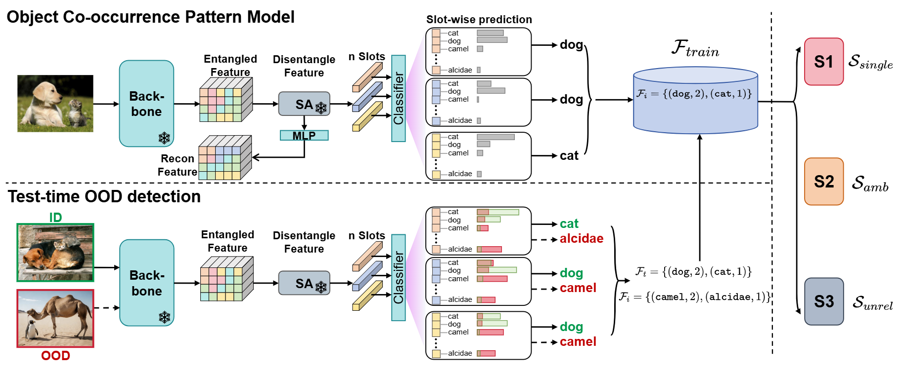

# Mitigating Simplicity Bias in OOD Detection through Object Co-occurrence Analysis

This repository provides the official implementation of the paper:

> **Mitigating Simplicity Bias in OOD Detection through Object Co-occurrence Analysis** (CVPR 2026)

([*Original Name*] Divide and Conquer: Object Co-occurrence Helps Mitigate Simplicity Bias in OOD Detection)

OCO is an object-centric OOD detection method that leverages **O**bject **CO**-occurrence patterns and a divide-and-conquer scoring strategy to mitigate simplicity bias and improve both challenging and full-spectrum OOD detection. Below is the pipeline:




## Installation

Our implementation is based on the [OpenOOD](https://github.com/Jingkang50/OpenOOD) framework. For more detailed environment configuration and instructions, please refer to [https://github.com/Jingkang50/OpenOOD](https://github.com/Jingkang50/OpenOOD).

```bash
# Clone the repository
git clone https://github.com/Michael-McQueen/OCO.git
cd OCO

# Create and activate a new Conda environment
conda create -n oco python=3.10
conda activate oco

# Install required dependencies
pip install git+https://github.com/Jingkang50/OpenOOD
pip install libmr
pip install timm
```


## Dataset Preparation

Download the required benchmark datasets using the provided script:

```bash
bash scripts/download/download.sh
```

> **Note:** For the ImageNet-1K training images, due to copyright restrictions, please ensure you have downloaded them from the official ImageNet website and placed them in the appropriate `./data` directory structure.


## How to Run

Running the OCO pipeline involves a two-step process: pretraining the Slot Attention module, followed by the integrated 3-stage OCO training and evaluation pipeline.


### Step 1: Pretrain Slot Attention

Before training the main OCONet, you should obtain a pre-trained Slot Attention checkpoint.

1. Clone and follow the instructions in the [DINOSAUR repository](https://github.com/gorkaydemir/DINOSAUR/tree/main) to pre-train the model on the default COCO 2017 dataset.
2. Configuration Settings: resize images to 224x224 and set `slot_num` to 6. Leave other hyperparameters as their defaults.
3. Save the resulting checkpoint. 


### Step 2: Execute the OCO Pipeline

Once your pretrained checkpoint is in place, you can execute the full OCO methodology on ImageNet-1K using the provided bash script.


```bash
bash scripts/ood/oco/oco.sh
```

The `oco.sh` script automates the full 3-stage methodology:
- `Stage A`: Using ID data to train OCONet.
- `Stage B`: Building $F_{train}$.
- `Stage C`: OOD/FS-OOD evaluation.


## Acknowledgements

This codebase is built upon [OpenOOD](https://github.com/Jingkang50/OpenOOD). We thank the authors for their excellent work.


## Citation

If you find this work useful, please cite our paper.
```bibtex
@InProceedings{Dai_2026_CVPR,
    author    = {Dai, Boyang and Chen, Chaoqi and Yu, Yizhou},
    title     = {Mitigating Simplicity Bias in OOD Detection through Object Co-occurrence Analysis},
    booktitle = {Proceedings of the IEEE/CVF Conference on Computer Vision and Pattern Recognition (CVPR)},
    month     = {June},
    year      = {2026},
    pages     = {20345-20355}
}
```